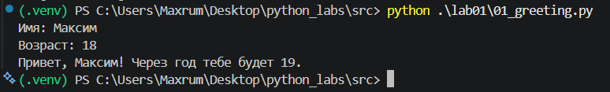
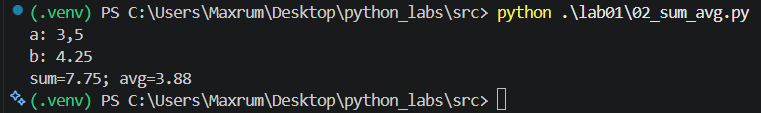
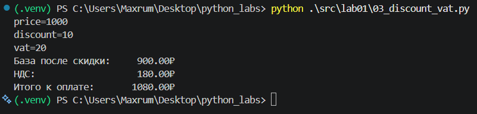
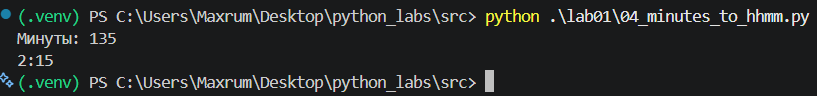
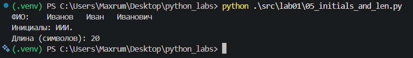
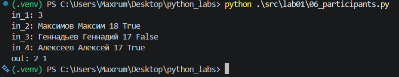
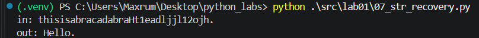

## ЛР1 — Ввод/вывод и форматирование

### Задание 1

Круто выводим данные при помощи f-строки.

### Задание 2

2 формулы + округление f-строкой. Замена , на .

### Задание 3

3 формулы + красивый вывод с 2 знаками после запятой

### Задание 4

Перевод минут в часы при помощи операторов // и %.

### Задание 5

Делим строку сплитом. Для инициалов берем 1 символ каждого слова и объединяем в строку. Для длины берем сумму длин слов + 2 пробела.

### Задание 6

При помощи сплита находим только последний параметр каждого участника и считаем количество True и False.

### Задание 7

Сначала находим первый символ исходной строки, затем второй. Собираем строку с шагом разницы индексов второго и первого символов до первой точки.

