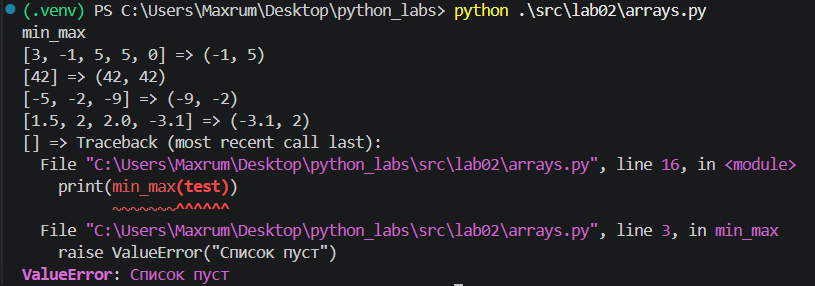
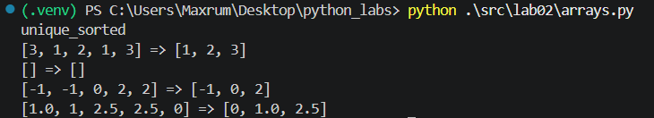
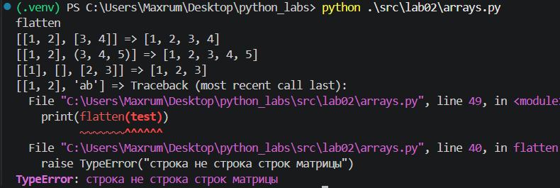
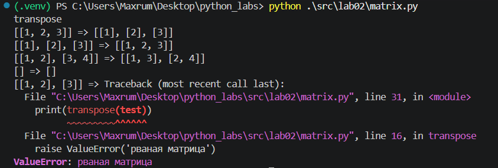
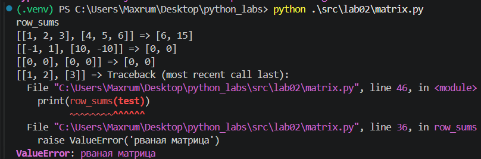
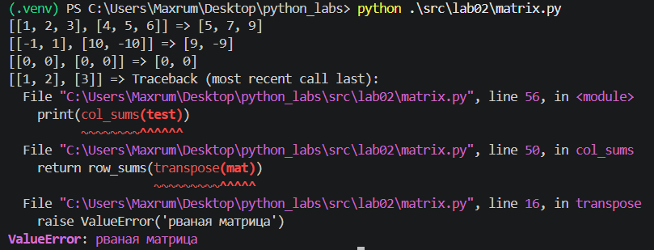
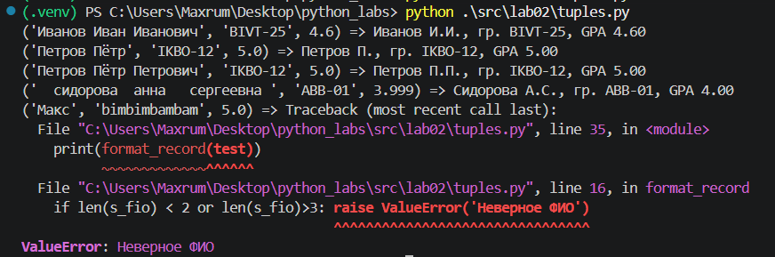

## ЛР2 — Коллекции и матрицы (list/tuple/set/dict)

# Задание 1 (arrays.py)

Реализация функций:

min_max(nums) — возвращает кортеж из минимального и максимального элементов списка. Если список пуст, вызывает ValueError.

unique_sorted(nums) — возвращает список уникальных элементов, отсортированных по возрастанию.

flatten(mat) — преобразует список списков и кортежей в один плоский список. Если элемент матрицы не является списком или кортежем, вызывает TypeError.

# Задание 2 (matrix.py)

transpose(mat) — транспонирует матрицу, меняя строки и столбцы местами. Для рваной матрицы вызывает ValueError.

row_sums(mat) - вычисляет и возвращает список сумм элементов каждой строки матрицы. Для рваной матрицы вызывает ValueError.

col_sums(mat) — вычисляет и возвращает список сумм элементов каждого столбца матрицы. Для рваной матрицы вызывает ValueError.

# Задание 3 (tuples.py)

format_record(rec) — форматирует запись студента, представленную кортежем (ФИО, группа, GPA). Формирует инициалы, удаляет лишние пробелы и выводит средний балл с двумя знаками после запятой.
