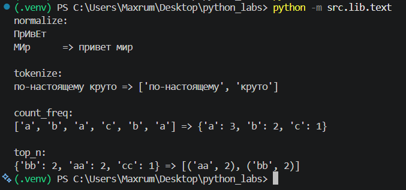
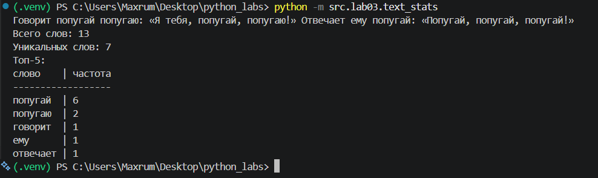
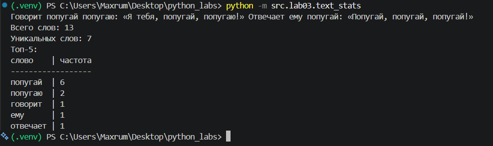

## ЛР3 — Обработка текста

# Задание 1 (text.py)

Реализация функций:

normalize(text) — нормализует текст: приводит символы к нижнему регистру, заменяет ё на е и удаляет лишние пробелы.

tokenize(text) — разбивает текст на отдельные слова.

count_freq(tokens) — подсчитывает частоту каждого слова.

top_n(freq, n) — возвращает n самых часто встречающихся слов. При одинаковой частоте слова сортируются в алфавитном порядке.

# Задание 2 (text_stats.py)

Программа читает одну строку текста с помощью input() и выводит:

- общее количество слов
- количество уникальных слов
- топ-5 самых часто встречающихся слов

# Задание 3 — Табличный вывод

Добавлен дополнительный режим вывода статистики в виде таблицы.

Режим переключается с помощью константы TABLE:

- `TABLE = 0` — обычный вывод;
- `TABLE = 1` — табличный вывод.

Ширина столбца со словами автоматически определяется по самому длинному слову из топ-5.

